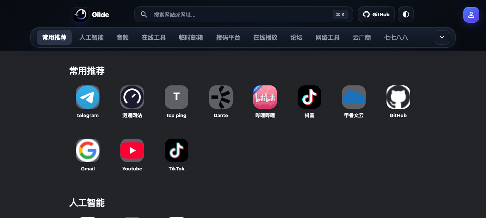
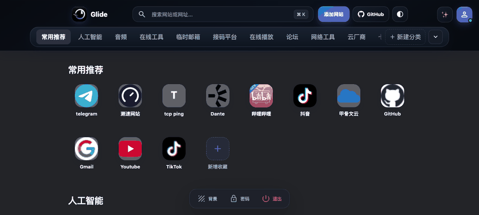
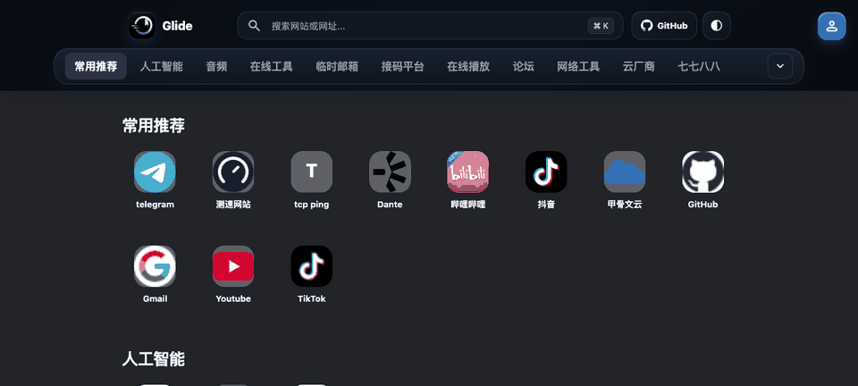

# Glide 个人导航

一个极简的个人书签导航页：单页静态前端 + Cloudflare Worker 后端 + AI 自动生成书签中文简介。
前端托管在 GitHub Pages，共享数据通过 Cloudflare KV 保存。

## 预览

### 游客主页（未登录）



### 管理员主页（登录后）


## 核心功能演示

### ✨ AI 一键生成书签中文备注



*打开任意书签的编辑弹窗，点「✨ 生成备注」自动生成中文简介，调用 Cloudflare Workers AI（免费）。*

### 📌 分类栏吸顶 + 滚动跟随高亮



*向下滚动浏览时，分类栏始终吸顶在顶部；当前阅读的分类（人工智能 / 临时邮箱…）自动高亮，并显示 3px 主色下划线。*

## 功能亮点

- ✨ **AI 自动生成书签中文简介**：基于 Cloudflare Workers AI（免费），一键给书签填入简洁准确的中文描述；也支持接入自定义 API（DeepSeek / 智谱 / Gemini 等 OpenAI 兼容服务）
- ✨ **AI 一键批量生成**：管理员模式下可在 AI 设置里批量为全部书签生成中文备注
- **高清书签图标自动抓取**：优先抓取 `apple-touch-icon`，回退到 256px favicon，最后兜底首字母
- **访客 / 管理员模式**：访客只看不改；管理员登录后可增删改分类和书签
- **暖色浅色主题**：米色背景 + 暖琥珀主色，顶部导航/按钮/分类栏/弹窗/表情选择器统一暖色系
- **分类栏贴边渐隐**：默认右端虚化提示"还有分类"，向左滑动后才出现左端渐隐，不打扰首个分类
- **分类图标选择器**：微信表情包式 24 图标网格，点击即用，也支持自定义输入
- **记住密码**：勾选后密码明文存本机浏览器，下次打开登录框自动填入（仍需点登录）
- **拖拽排序**：分类和书签都支持拖拽排序和跨分类移动
- **Safari 书签/主屏幕图标优化**：标准 180×180 `apple-touch-icon` + 64×64 `favicon`，添加书签时自动带出
- **暗色 / 亮色主题**：跟随系统或手动切换
- **全键盘可达**：`⌘/Ctrl + K` 聚焦搜索

## 完整功能

- 分类新增、重命名、删除与拖拽排序
- 网站新增、编辑、删除、同分类排序与跨分类拖放
- 高清书签图标自动抓取（优先 `apple-touch-icon`）
- ✨ AI 生成书签中文简介（Cloudflare Workers AI 免费 / 自定义 API / Gemini）
- ✨ 批量为全部书签生成备注（管理员 → AI 设置 → 批量生成）
- 按名称或网址搜索，`⌘/Ctrl + K` 聚焦
- 暗色 / 浅色主题、玻璃拟态界面
- 暖色浅色主题：深亚麻咖背景，顶部导航/按钮/分类栏/弹窗全部统一暖色系
- 分类栏贴边渐隐：默认右端虚化提示，滑动后才出现左端渐隐；选中分类有 3px 主色下划线
- 分类图标选择器：微信表情包式 24 图标网格（8 列），手机端自动 6 列
- 登录界面「记住密码」：勾选后密码明文存本机浏览器，下次自动填入
- 顶部横向分类栏吸顶，随滚动自动高亮当前分组
- 管理员可更换网页背景、设置 / 修改 / 清空密码
- 访客模式隐藏全部修改操作
- 手机端使用可横向滑动的顶部分类栏；长按卡片可快速编辑
- Safari 添加书签/主屏幕：标准 `apple-touch-icon`（180×180）+ `favicon`（64×64）

## 快速部署（小白教程 · 7 步）

把仓库复制到你自己的账号下，按下面 7 步就能跑起来一个属于你的导航站。每个 fork 都有**完全独立**的 Worker、KV 和管理员密码，不会读到原站数据。

### 0. 准备

需要两个免费账号：

- **GitHub**（[github.com](https://github.com)）—— 托管前端代码
- **Cloudflare**（[cloudflare.com](https://cloudflare.com)）—— 跑 Worker 后端 + 存书签数据

### 1. Fork 仓库

点本仓库右上角的 **Fork** 按钮，复制到你自己的 GitHub 账号下。

### 2. 发布前端（GitHub Pages）

1. 进入你 fork 的仓库 → **Settings → Pages**
2. **Source** 选 **Deploy from a branch**，Branch 选 `main`，目录选 `/ (root)`
3. 点 **Save**，等 1-2 分钟，页面顶部会显示你的访问地址

> 形如 `https://你的用户名.github.io/glide-personal-navigation/`

想用自己的域名？在仓库根目录的 `CNAME` 文件里写你的域名，然后把域名 DNS 指到 GitHub Pages 即可。

### 3. 创建 Cloudflare KV

1. Cloudflare 控制台 → **Workers & Pages → KV**
2. 点 **Create a namespace**，名字随意（例如 `glide-kv`）
3. 创建后，复制 Namespace **ID**（一串十六进制字符）

### 4. 修改 Worker 配置

在你 fork 的仓库里，编辑 `worker/wrangler.jsonc`，把 `kv_namespaces` 里的 `id` 改成你刚才复制的 KV ID：

```jsonc
{
  "kv_namespaces": [
    { "binding": "GLIDE_KV", "id": "把这里改成你的 KV ID" }
  ]
}
```

- 如果你用自己的域名且 Worker 路由在该域名下：保留 `routes` 配置并改成你的域名
- 如果你想用 Cloudflare 提供的免费 `*.workers.dev` 域名：**删掉整个 `routes` 数组**

### 5. 部署 Worker（推荐用 Cloudflare Git 集成，零本地）

1. Cloudflare 控制台 → **Workers & Pages → Create → Pages → Connect to Git**
2. 选 GitHub，授权并选择你 fork 的仓库
3. 部署配置：
   - **Root directory (advanced)** 填 `worker`
   - **Build command** 留空
   - **Deploy command** 填 `npx wrangler deploy`
4. 点 **Save and Deploy**，等 1-2 分钟完成首次部署
5. （强烈建议）让 AI 备注功能可用：到 Worker → Settings → **Bindings** → **Variable** 添加绑定，Variable name 填 `AI`，类型选 **AI**，保存。这步给 Worker 接上 Cloudflare 的 Workers AI 服务，AI 生成备注就能免费用了

### 6. 让前端连到 Worker

- **如果你用自己的域名**（Worker 路由也在该域名下，推荐）：**不用改任何东西**，前端自动同域请求 `/api/*`
- **如果你用 workers.dev 免费域名**：编辑 `app.js` 第一行，把空字符串改成你的 Worker 地址：
  ```js
  const API_URL='https://glide-navigation-api.你的子域名.workers.dev';
  ```
  （注意保留引号；commit 后 GitHub Pages 自动重新部署）

### 7. 首次登录

打开你的导航站，点右上角的人头图标：

- 账号：`admin`
- 密码：**留空**直接点登录

登录后：

- 顶部出现「＋ 添加网站」按钮
- 底部出现「背景 / 密码 / 退出」三个按钮
- **点底部「密码」** → 设置你自己的密码

完事 🎉 现在你可以增删改分类、书签，要 AI 写备注就点编辑弹窗里的「✨ 生成备注」（或 AI 设置里的「批量生成」）。

---

## 本地运行（不部署，临时看看）

最简单：双击 `index.html` 用浏览器打开。

也可以起一个本地静态服务器（这样 AI 生成备注等需要后端 Worker 的功能才能跑）：

```bash
python3 -m http.server 8080
# 浏览器打开 http://localhost:8080
```

## 云端数据

分类、书签、背景图和 AI 配置都保存在 **Cloudflare KV**。管理员修改后 Worker 自动写入云端，访客打开网页时自动读取同一份数据。

- 默认管理员账号：`admin`
- 初始密码：空（**登录后请在底部「密码」按钮里设置**）

## 文件结构

```text
index.html            页面结构
styles.css            视觉、主题与响应式布局
app.js                数据、编辑、拖拽、搜索、AI 生成逻辑
details-data.js       书签默认详情
reference-data.js     书签默认分类（首次加载用）
worker/               Cloudflare Worker 后端
  ├ src/index.js      /api/* 接口（favicon、login、state、AI、remark）
  └ wrangler.jsonc    KV 和路由配置
CLOUDFLARE-DEPLOY.md  详细 Cloudflare 部署参考
visitor.png           游客主页预览
admin.png             管理员主页预览
docs/demo/            README 演示 GIF
  ├ ai.gif            AI 一键生成书签中文备注
  └ scroll.gif        分类栏吸顶 + 滚动跟随高亮
```

## Fork 隔离

Fork 只会复制代码，不会复制：

- ❌ 原站的 Cloudflare KV（你用自己的 KV，从零开始）
- ❌ 原站的管理员密码（你自己重新设置）
- ❌ 原站的书签数据（首次访问时 KV 是空的，只有一个默认「常用推荐」分类）

第一次部署后你的站是空的，往里面加书签就行。

---

觉得好用就 ⭐ Star 一下，有问题开 [Issue](https://github.com/Maxzzj777/glide-personal-navigation/issues)。